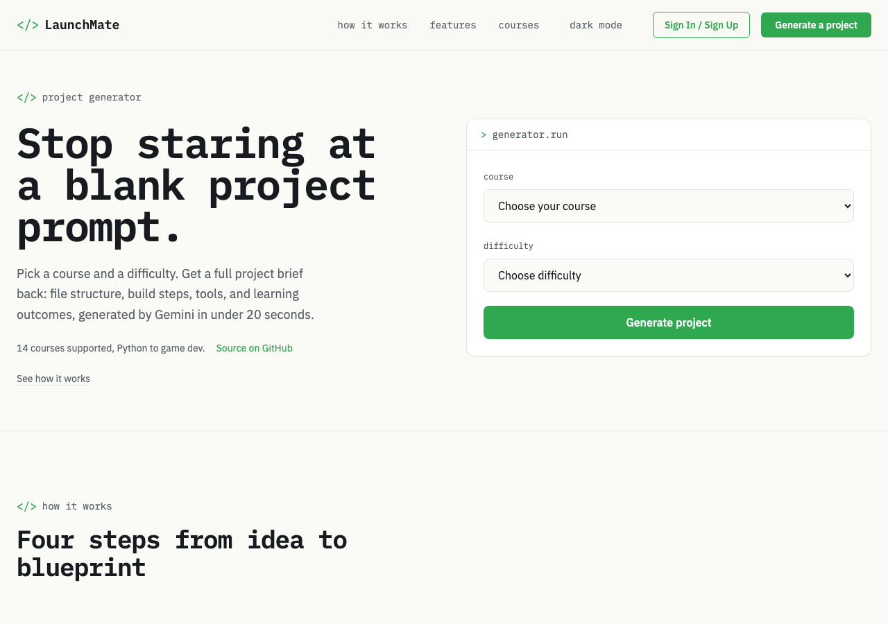
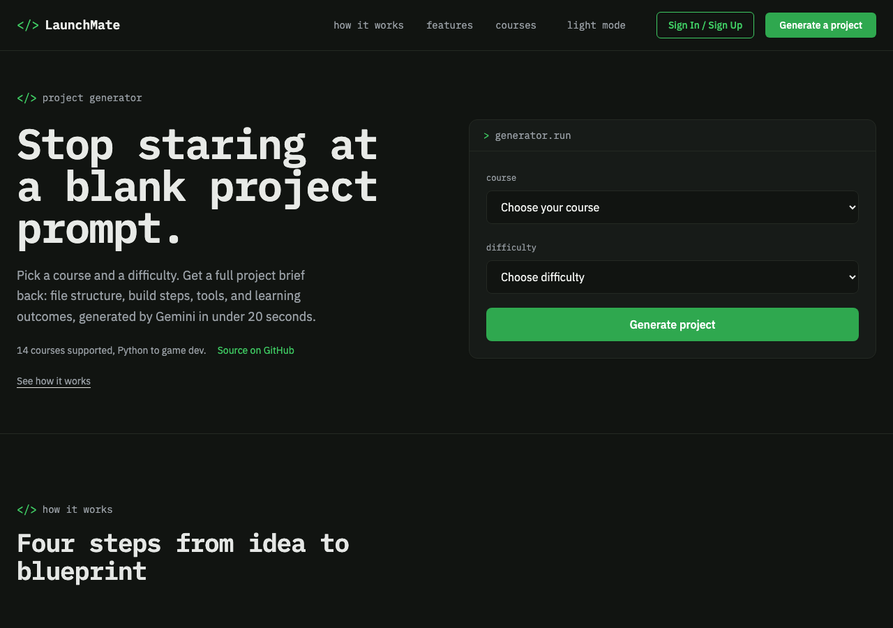
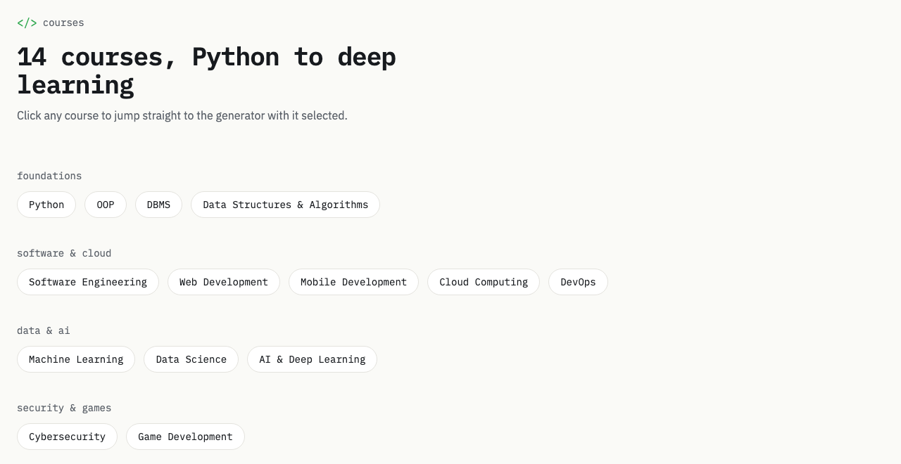

# LaunchMate - AI-Powered Project Idea Generator

LaunchMate is a productivity tool that helps university students generate **practical, course-aligned project ideas** using AI. It supports **user profiles, project history**, and a smarter, prompt-engineered system for **accurate project generation**.

---

## Screenshots

| Light mode | Dark mode |
|---|---|
|  |  |

Courses, grouped into a compact tag cloud instead of repeated cards:



---

## How It Works

1. Select your course and difficulty level
2. Click **Generate Project**
3. Google Gemini generates a structured, implementable project idea
4. Get a full project spec, including:
   - Title & Description
   - Tools & Technologies
   - Suggested File Structure
   - Learning Outcomes
   - Build Steps
   - Bonus Feature
   - Estimated Completion Time
   - External Resources

---

## What's New in v1.1

- **User Sign-in with Supabase Magic Link Auth**
- **Database-backed project saving (Supabase)**
- **Saved project history in user profile**
- **Fully responsive UI for mobile and desktop**
- **Copy to Clipboard** functionality for quick access
- **Individualized Prompting for 14 Courses**
- Solved LLM hallucination issue through **course-specific prompts**
- Redesigned landing page: real generator UI in the hero, distinct section layouts, and a fully themed dark mode

---

## Tech Stack

- **Frontend**: Jinja templates, Tailwind CSS (compiled build), vanilla JavaScript
- **Backend**: Python, Flask
- **AI Integration**: Google Gemini API
- **Database**: Supabase (PostgreSQL + Auth)
- **Hosting**: PythonAnywhere

---

## Project Structure

```
launchmate/
├── app/
│   ├── generator.py         # Project generation logic
│   ├── ai_generator.py      # Handles communication with Gemini API
│   └── utils.py             # Helper functions (e.g., fallback logic)
│
├── static/
│   ├── style.css            # Tailwind source styles
│   ├── output.css           # Compiled Tailwind build
│   └── script.js            # Frontend logic and interactions
│
├── templates/
│   ├── index.html           # Homepage
│   ├── profile.html         # User profile view
│   ├── login.html           # Supabase Magic Link sign-in
│   └── project.html         # Individual project detail view
│
├── docs/
│   └── screenshots/         # README screenshots
│
├── fallback_projects.json   # JSON-based project backup if API fails
├── server.py                # Flask server (main app entrypoint)
├── .env                     # Environment variables (Gemini + Supabase)
├── requirements.txt         # Python dependencies
└── README.md                # This documentation file
```

---

## Features

- **AI-Powered Generation:** Uses Google's Gemini model for intelligent project suggestions
- **Course-Specific:** Tailored to different courses and subjects
- **Difficulty Levels:** Adjustable project complexity
- **Structured Output:** Comprehensive project specifications
- **Export Options:** Generate Markdown files for projects
- **Error Handling:** Robust error management with fallback options

---

## Contributing

Contributions are welcome! Please feel free to submit a Pull Request.

---

## License

This project is licensed under the MIT License - see the LICENSE file for details.
